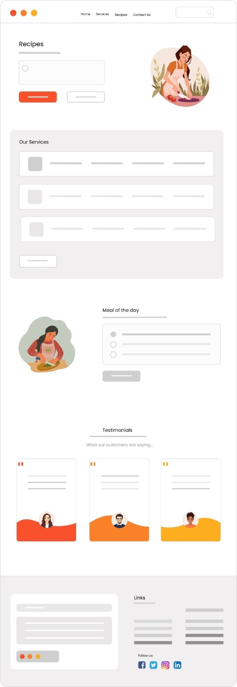

# Bites Across Borders

## Description:

The web app provides access to a diverse array of recipes from across the globe, all translated into the user's preferred language for easy understanding and cooking. Utilizing JavaScript and the Tasty API for recipe information, as well as the Text-Translate API for language translation, the app updates the HTML and CSS dynamically in the browser. Users can search for specific recipes or hit the "Inspire Me" button for a randomly generated one.

<!-- TODO: Update with a screenshot of the finished application -->

## Instructions:

1. Search bar located at top of app homepage.
2. Search results open on new page with recipe information including ingredients, prep time, portions and cooking instructions.
3. "Translate" option on recipe page for selecting language.
4. Dynamic real-time translation of recipe and information upon selecting "Translate".
5. Homepage features 3 featured recipes with pictures and "Inspire Me" button for random recipe selection.

## Deployment:

<!-- TODO: Links for Github Page and URL -->

## Credits:

This app was developed by [@Emman77240](https://github.com/Emman77240), [@Fi-OD](https://github.com/Fi-OD), [@eliyas4](https://github.com/eliyas4) and [@analupucci](https://github.com/analupucci).

- [Tasty API](https://rapidapi.com/apidojo/api/tasty) to query data about recipe, cooking instructions and ingredients. 
- [text-translate2 API](https://rapidapi.com/dickyagustin/api/text-translator2)  Translate text to 100+ languages.

## Reference:

- [W3Schools](https://www.w3schools.com)
- [MDN](https://developer.mozilla.org/en-US/)

