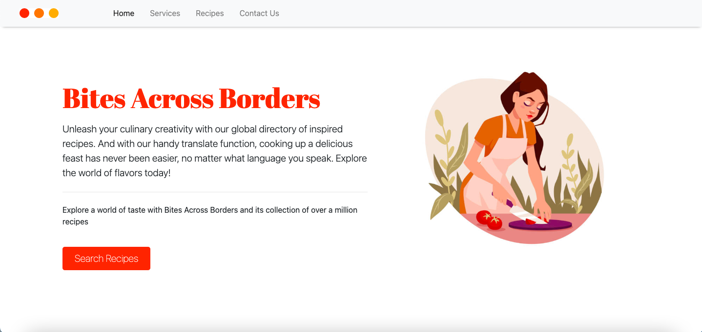
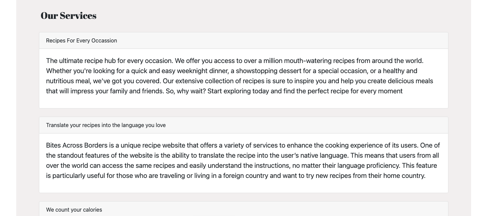
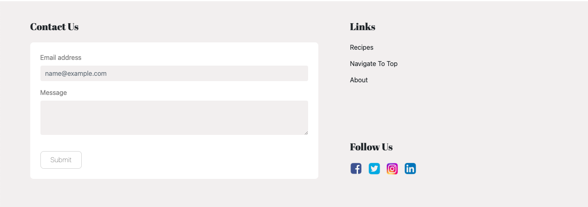
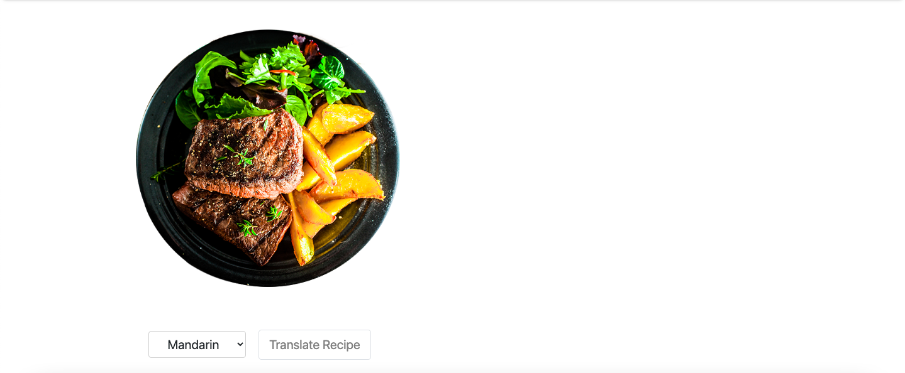

# Bites Across Borders

## Description:

The web app provides a platform for users to easily access and cook delicious recipes from around the world in their native language, thanks to the Tasty API and Text-Translate API. JavaScript dynamically updates the HTML and CSS within the browser, allowing for recipe search and language translation. Additionally, users can upload their own recipes using a Contact form via the Postmail API. 

## Instructions:

1. Search bar located at top of app homepage.
2. Search results open on new page with recipe information including ingredients, prep time and cooking instructions.
3. "Translate" option on recipe page for selecting language.
4. Dynamic real-time translation of recipe and information upon selecting "Translate".
5. Users can upload their own recipe via the contact form.

## Deployment:

[Webpage](https://fi-od.github.io/ApiProjectGroup/)
[Github](https://github.com/Fi-OD/ApiProjectGroup)

## Credits:

This app was developed by [@Emman77240](https://github.com/Emman77240), [@Fi-OD](https://github.com/Fi-OD), [@eliyas4](https://github.com/eliyas4) and [@analupucci](https://github.com/analupucci).

- [Tasty API](https://rapidapi.com/apidojo/api/tasty) to query data about recipe, cooking instructions and ingredients. 
- [text-translate2 API](https://rapidapi.com/dickyagustin/api/text-translator2)  Translate text to 100+ languages.
- [postmail API](https://postmail.invotes.com/) Contact form. 

## Reference:

- [W3Schools](https://www.w3schools.com)
- [MDN](https://developer.mozilla.org/en-US/)